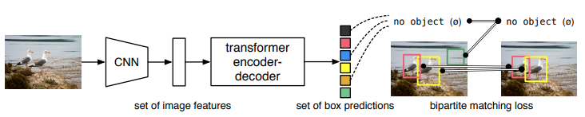
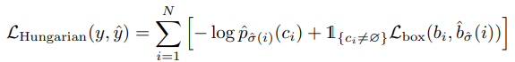
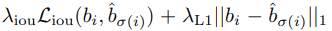
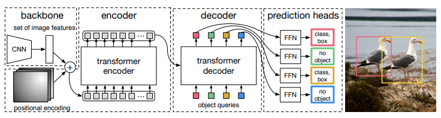
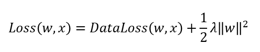
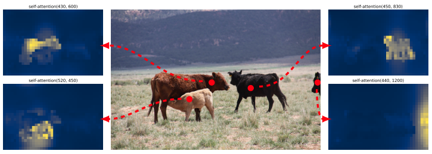
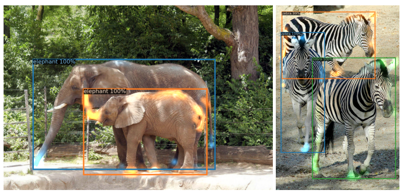

본 포스팅은 아래 논문과 동영상을 참고했습니다.

- <https://arxiv.org/pdf/2005.12872.pdf>
- <https://www.youtube.com/watch?v=hCWUTvVrG7E&t=40s&ab_channel=%EB%8F%99%EB%B9%88%EB%82%98>
- <https://zzsza.github.io/data/2018/02/23/introduction-convolution/>

## Abstract

- object detection을 direct set prediction 문제로 본다.
- detection의 pipeline을 간소화 한다.
  - 특히 NMS(non-maximum suppression)이나 prior knowledge를 encode하는 anchor generation 과 같은 수작업이 필요한 것을 제거한다.
    

    

        NMS
    

    

    - bounding box 리스트 B에서 가장 score가 높은 것을 D로 옯기고, 그것과 B안의 원소들의 iou를 비교하여 threshold가 넘으면 B에서 삭제한다.
    - B안의 모든 원소를 확인하면 B에 남은 bounding box 중 score가 가장 높은 것을 D로 옮기고, 앞에서 한 과정을 다시 한다.
    

  

- DETR의 큰 특징은 partite matching과 transformer를 사용한다는 것이다.
  - transformer를 사용하기 때문에 parallel하게 계산할 수 있다.
- Fast R-CNN과 비슷한 accruacy와 run-time performance를 보여줬다.
- panoptic segmentation도 가능하다.

## 1. Introduction

- 기존에는 indirect 한 방식 사용.
  - surrogate regression, anchor, window
  - 겹쳐진 bounding box를 postprocessing 해야하는데 이것이 성능에 영향을 끼침.
- direct set prediction approach : 이분 매칭을 통해 중복되는 prediction 제거
- transformer의 self-attention은 element간의 interaction 을 계산한다. 이것은 중복된 prediction을 제거한다. 따라서 수작업이 줄어든다.
- bipartite matching loss와 parallel decoding을 사용한 transformer (기존의 작업은 autoregressive decoding with RNN 이었던 점과 대비된다.)
- 평가는 Fast R-CNN 과 비교했고, COCO 데이터 셋을 사용했다. 큰 물체는 성능이 좋았지만, 작은 물체는 성능이 좋지 않았다.
- ablation study라는 component들을 제거한후 학습해서 평가하는 방법도 사용했다.
- Training setting은 기존과 많이 달랐다.
  - training schedule(?)이 너무 길다는 문제가 있었다.
  - auxiliary decoding loss로 좋은 점도 있었다.

---

## 2. Related work

### 2.1 Set prediction

- direct set prediction은
  - postprocessing-free하다.
  - global inference schemes가 필요하다. 따라서 기존에는 RNN과 같은 auto-regressive sequence model을 사용했다.
- Hungarian algorithm을 활용하여 bipartite maching을 했다.

### 2.3 Object Detection

- 최근 방법은 proposal을 사용했고, hand-crafted process를 거치는 방법이었다.
- detr처럼 end-to-end set prediction을 사용한 방법이 있었다. bipartite-matching loss와 encoder-decoder 구조를 사용하는 것은 비슷했다. 하지만 detr은 transformer를 이용한다는 점이 다르다.

---

## 3. The DETR model

- direct set predictions 은
  - unique matching
  - objects 집합을 예측하고, 그들의 관계를 modeling 하는 것

### 3.1 Object detecion set prediction loss

중복되는 것을  줄이기 위해 match proposal이나 anchors와 같은 heuristic 한 방법을 사용하던 것을 아래와 같은 방법으로 대신하였다.

아래 식을 최소화 시키는 매칭 결과 $\sigma$를 찾았다.

여기서 $L_{match}$는 아래와 같은 hungarian loss를 사용했다.

위 식을 사용하므로 score값 $\hat{p}_{\hat{\sigma}}$ 를 최대화, $L_{box}$ 를 최소화 하게 된다.

여기서 $L_{box}$는 아래 식으로 사용한다.

이것의 의미는 bbox가 많이 겹치도록 하고, error loss를 키운다.(?)

### 3.2 DETR architecture

> 위와 같이 backbone, encoder, decoder, prediction heads로 구성
>
- backbone
  - Backbone으로 CNN 사용하여 feature 추출
- encoder
  - encoder 입력 : backbone을 거쳐서 feature map이 $\R^{d\times{H}\times{W}}$ 인데, 이것을 $d\times{HW}$ 로 flatten해서 바꾸고 encoder에 입력
  - encoder : self-attention + feed forward network + positional encoding
  - self-attention : 각각이 서로에게 미치는 영향 파악
- decoder
  - decoder 입력 : N개의 d차원의 learned positional embedding(object queries) +
  - decoder : self- , encoder-decoder attention 을 통한 globally한 추론
- prediction feed forward networks
  - center coordinates, height, width 예측
  - no object 라는 빈 클래스 표현도 있음
- Auxiliary decoding losses
  - output의 개수를 맞추는데 도움됨. 각각의 decoder layer의 끝에 FFN과 Hungarian loss를 predict

--- 

## 4. Experiments

정성적인 방법을 사용했고, ablation study도 했다. panoptic seg도 진행하여 확장성을 증명 했다.

> - COCO dataset
> - lr : $10^{-4}$, backbone lr : $10^{-5}$, weight decay $10^{-4}$
>     

>     

>         weight decay
>     

>     

> 
>     
> 
>     weight가 너무 크면 panelty를 줌
> 
>     

> 
>   

> 
> - backbone으로는 resnet-50, resnet-101사용
> - dialation conv 사용으로 해상도 높여서 작은 object에 대한 성능을 향상
>   - DETR-DC5, DETR-DC5-R101 : dialated C5 stage
>     

>     

>         dilated convolution
>     

>     

> 
>     
> 
>     9개의 파라미터로 5x5 커널과 동일한 시야를 가짐.
> 
>     real-time segmentation분야에 주로 사용
> 
>     receptive field를 늘려 넒은 시야를 가져야할 필요가 있고, 여러 conv나 큰 커널을 사용할 여유가 없는 경우 사용됨.
> 
>     

> 
>   

> - Scale augmentation, random crop augmentation

실험 결과 

1. DETR, DETR-DC5, DETR-R101, DETR-DC5-R101 중에서 DETR-DC5-R101이 젤 성능 좋았음 
2. 작은 object는 fast-rnn이 더 좋고, 큰 object는 detr이 성능이 좋음
3. encoder layer 개수, decoder layer 개수 둘 다 중요함. 하나의 decoding layer로는 cross-correlation을 계산하기에 부족함. 
4. FFN, positional encoding도 중요함.
5. loss는 cls loss, l1 bounding box distance loss, GIoU loss 로 구성되는데, 3개가 다 있을 때가 가장 성능이 좋았다.
6. Panoptic segmentation도 잘한다. stuff+things 랑 stuff 둘다 잘한다. things만 할때는 다른 것에 밀린다.

분석

- Decoder에 들어가는 query는 각각 다른 위치에 다른 box 크기에 집중하도록 학습된다.
- Unseen data도 일반화 잘 한다.

- Encoder는 instance를 분리하는 역할을 한다고 추정

- Decoder는 instance의 말단을 추론하여 bounding box를 더 정교하게 추론하는 역할을 한다고 추정

## 5. Conclusion

- transformer와 bipartite matching loss를 사용
- self-attention을 통해 global한 information을 사용해서 큰 object에 대해서는 Faster R-CNN보다 성능이 좋았다.
- NMS와 같이 추가적인 것 없어도 됐다.