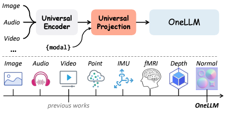
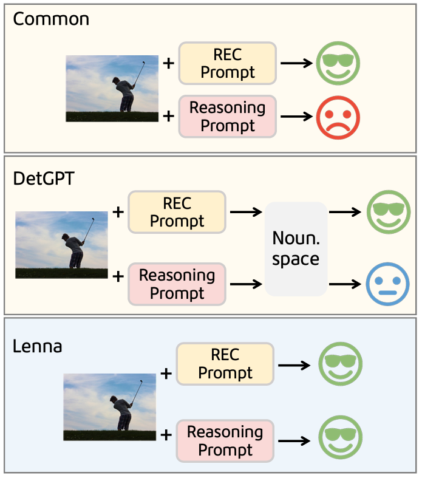

## 12/08

- OneLLM: One Framework to Align All Modalities with Language (2023-12-06)
  - 개별적인 encoder가 아니라 universal encoder를 쓸게요

### ***Lenna: Language Enhanced Reasoning Detection Assistant*** (2023-12-05)
  - LLM에 있는 reasoning power & world knowledge은 연구가 잘 안됨
  - detection을 위해 location information 을 유지한다. 
  - <DET> 토큰을 쓴다.
    - free of explicit semantic context (이해 잘 안됨. 새로운 토큰이기 때문에 의미가 없다?)
    - position을 찾기위한 prompt처럼 학습, prompt for detector, assisting it in pinpointing the relevant target position
    - ReasonDet으로 성능확인
    - 
      - REC prompt: explicit instruction으로 구성됨(a long slender golf club)
      - reasoning prompt: implicit intentions으로 구성됨(something showing that the man is playing sports), 잘 못함
      - DetGPT는 input prompt를 noun space에서 target names으로 translation 하려고 함(이해안됨)
  - Previous work: 이런 positioning capability에 관한 연구
    - InstructDet, Shikra, miniGPT-v2
    - DetGPT: reasoning based object detection에 관한 연구
  - LISA처럼 token embedding을 사용
> 다시 봅시다

- Dolphins: Multimodal Language Model for Driving (2023-12-01)
  - 자율주행
  - conversational driving assistant
- VTimeLLM: Empower LLM to Grasp Video Moments (2023-11-30)
  - video LLMs는 fine-grained video moment understanding, reasoning
- LLaMA-VID: An Image is Worth 2 Tokens in Large Language Models (2023-11-28)
  - 긴 동영상을 처리하기에 computational burdens이 있음, excessive visual tokens 때문
  - 각 frame은 context token과 content token으로 되어있음
    - context token: overall image context
    - content token: visual cues in each frame
  - overload를 크게 줄임