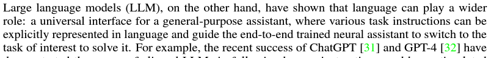
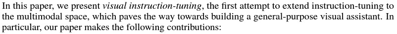
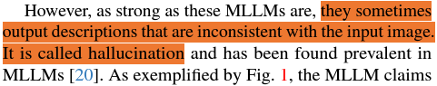
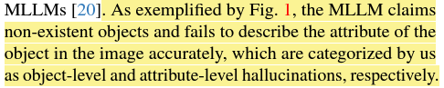
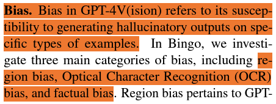
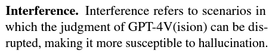
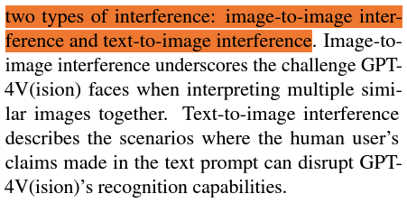
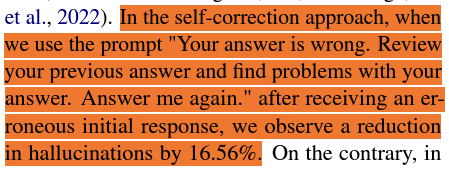
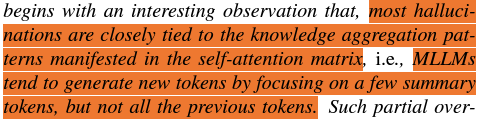

## LLAVA 보면서 Method부분 따라하자

- https://arxiv.org/pdf/2304.08485.pdf
- Intro 정리
  - 사람은 채널이용, vision-and-language instructions으로 general purpose assistant 만들기, wild 환경
  - wild환경
  - llm은 universal interface for a general purpose assistant 
  > 문장 좋다. 
  - 처음으로 instruction-tuning을 multimodal space로 extend
  - 
- Method 보기
  - GPT로 도움받아 visual instruction 생성
    - image-text pairs(CC, LAION)
  - 

## Hallucination 알아보기
- 논문 리스트
  - https://arxiv.org/pdf/2310.16045.pdf
    - hallucination을 뭐라고 하고 있나
    - 
    - hallucination을 해결하기 위해 어떻게 했나
      - 5 step
    - hallucination 종류가 뭔가
    - 
    - hallucination 평가 뭐로 했나
      - POPE: random, popular, andadversarial
        - 50 images, 6 questions, 1:1
        - yes/no
      - MME
        - existence, count &rarr; object-level
        - position, color &rarr; attribute-level
      - LLaVA-QA90
        - coco image 설명하는 것
        - gpt-4v로 평가하는 것
  - https://arxiv.org/pdf/2311.03287.pdf
    - GPT4V에 hallucination이 있음을 밝힘
    - benchmark 제안 bingo
      - bias, interference
      - 
      - 
      - 
    - self correction과 CoT reasoning
      - 
  - https://arxiv.org/pdf/2311.17911.pdf
    - OPERA
    - MLLM decoding method 
    - 
      - hallucination의 원인을 selfattention에서 찾을 수 있음
      - 모든 token이 아니라 직전 토큰만 본다.
      - attention을 normalize
      - > 이거 진짜 재밌는거같아. 꼭 다시 읽고싶어
  - https://arxiv.org/pdf/2311.16922.pdf
    - object hallucination
    - visual contrastive decoding(VCD)
      - simple, training free
      - orignal과 distorted visual input에서 나온 distribution을 contrasts
      - reduce over-reliance on statistical bias and unimodal priors (이 두개가 object hallucination의 큰 원인이다.)
      - > 이거 진짜 재밋다.. 또 보고 싶어
  - https://arxiv.org/pdf/2311.16839.pdf
    - > 일단 self-correction부터 읽고 올게
  - https://arxiv.org/pdf/2311.13614.pdf
  - https://arxiv.org/pdf/2310.01779.pdf
  - https://arxiv.org/pdf/2309.04041.pdf
  - https://arxiv.org/pdf/2309.02301.pdf
  - https://arxiv.org/pdf/2308.15126.pdf
  - https://arxiv.org/pdf/2308.12714.pdf
  - https://arxiv.org/pdf/2308.06394.pdf
  - https://arxiv.org/pdf/2306.14565.pdf
  - https://arxiv.org/pdf/2305.10355.pdf
  - https://arxiv.org/pdf/2306.14565.pdf
  - https://arxiv.org/pdf/2311.03287.pdf
  - https://arxiv.org/pdf/2308.06394.pdf
- 여기서 봐야할 것
  - hallucination을 뭐라고 하고 있나
  - hallucination을 해결하기 위해 어떻게 했나
  - hallucination 종류가 뭔가
  - hallucination 평가 뭐로 했나

## Self-correction
https://arxiv.org/pdf/2310.01798.pdf

## CoVe

## AK 보기

- Schrodinger Bridges Beat Diffusion Models on Text-to-Speech Synthesis
  - TTS diffusion
  - data-to-noise diffusion에서 noisy representation이 restricted
  - 가우시안 노이즈를 대체하는 방법
  - fully tractable Schrodinger bridge 
- Relightable Gaussian Codec Avatars
  - high-fidelity animated head avatars with detailed geometry and realistic appearance
  - 3D Gaussian-based geometry model captures intricate structures like hair strands and pores in dynamic face sequences
- Kandinsky 3.0 Technical Report
  - text-to-image generation
  - two times larger U-Net backbone, a ten times larger text encoder, and eliminates diffusion mapping
- Gaussian Head Avatar: Ultra High-fidelity Head Avatar via Dynamic Gaussians
  - 3D head avatar modeling
  - 3D Gaussians and a learned MLP-based deformation field to optimize neutral Gaussians and capture intricate expressions
- OneLLM: One Framework to Align All Modalities with Language
  - 인코더 하나 쓰는거, 이미 읽음
- MotionCtrl: A Unified and Flexible Motion Controller for Video Generation
  - video generation 
  - independently manages both camera and object motion
- HiFi4G: High-Fidelity Human Performance Rendering via Compact Gaussian Splatting
  - high-fidelity human performance
  -  Gaussian-based representation
- Cache Me if You Can: Accelerating Diffusion Models through Block Caching
  - block caching, 디퓨전 위한 테크닉, 연산량 줄임
- Context Diffusion: In-Context Aware Image Generation
  - in-context learning from visual examples
  - improved image quality and fidelity
- LooseControl: Lifting ControlNet for Generalized Depth Conditioning
  - generalized depth conditioning for diffusion-based image generation
- DreamComposer: Controllable 3D Object Generation via Multi-View Conditions
  - multi-view conditions 통합
- Self-conditioned Image Generation via Generating Representations
  - class-unconditional image generation without relying on human annotations
- MagicStick: Controllable Video Editing via Control Handle Transformations
  - controllable video editing
- Multimodal Data and Resource Efficient Device-Directed Speech Detection with Large Foundation Models
  - instruction을 좀더 natural하게
  - trigger phrase를 eliminate
  - speech recognition인가봄
- Language-Informed Visual Concept Learning
  - visual concept representation을 학습함. 
  - distilling large pre-trained vision-language models을 통해
  > 잘 보고 싶은데 졸려서 못보겠음
  > 가우시안 모델 나오는거 보는거 의미없다. 생성모델도 별 의미 없음 앞으로 제목만 보자

